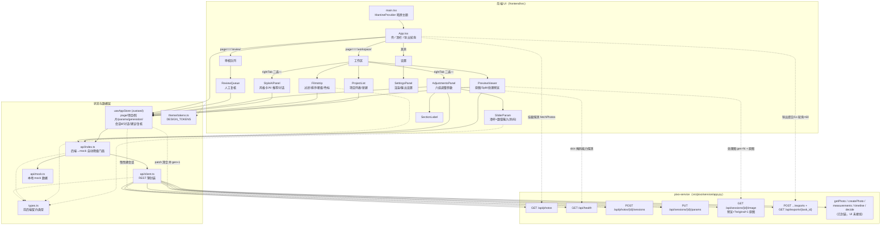

# PROJECT_GRAPH_FRONTEND —— 前端 + 资产项目图谱（人读版）

> 配套机读版：[`docs/project_graph_frontend.json`](./project_graph_frontend.json)。
> 本文件只覆盖**前端与 configs/ 资产**；全仓图谱（含后端管线内部结构）归 t14 的
> `docs/PROJECT_GRAPH.md` 所有，本文档不写该文件，避免并行同改。
>
> 数据口径：前端边全部以 `frontend/src/**` 的**实际 import 语句**为准（2026-08-28 实扫，
> 对应 git `f48d453` 后的工作区）；资产统计由脚本现场读取 JSON/YAML 计算，非手抄。

---

## 1. 机读版格式（t14 --merge 输入）

`project_graph_frontend.json` 顶层**严格只含两数组**，可直接作为 t14 脚本 `--merge` 的输入：

```json
{ "nodes": [...], "edges": [...] }
```

- **node**：`{ "id", "type", "label", ...扩展字段 }`；扩展字段含 `path` / `note` /
  `stage_frequency` / `cards` 等，合并方按 id 覆盖或保留均可。
- **edge**：`{ "id", "from", "to", "relation", ...扩展字段 }`；字段命名沿用本仓库
  `configs/knowledge/*.json` 的图惯例（`from`/`to`/`relation`）。
- id 命名空间：`fe:*`（前端文件/组件/页面）、`ep:*`（REST 端点）、`asset:*`（资产）、
  `be:*`（后端模块）。规模：**85 节点 / 129 边**，已自检 id 唯一、无悬空边。

关系词表（relation）：

| relation | 含义 | 方向 |
|---|---|---|
| `imports` | 静态 import（含 symbols 列表） | 使用方 → 被引方 |
| `renders` / `contains` | App 条件渲染页面 / 页面装配组件 | App → page → 组件 |
| `wraps` | client.ts 函数封装端点 | client → endpoint |
| `calls` / `builds_url` | 运行时真实触发端点 / 拼图片 URL | 触发方 → endpoint |
| `serves` | FastAPI 路由挂载端点 | service/app.py → endpoint |
| `loads` / `consumes` | 后端模块读取资产 | 模块 → 资产 |
| `stage_key` | 胶片卡 stages 键映射到 stage 模块 | films 卡库 → 模块 |
| `mirrors` / `aligns` | 前端常量/类型与后端 schema 手工对齐（无 import） | 双向语义，见 note |

---

## 2. 前端组件图

技术栈：React 18 + Mantine 7 + zustand 5 + Vite 5 + TypeScript 5.6；e2e 用 Playwright
（`frontend/e2e/smoke.mjs` 等）。单页应用，无路由库——"页面"是 store 里的 `page` 状态，
由 `App.tsx` 条件渲染。



### 2.1 组件清单与职责

| 组件 | 文件 | 读 store | 写 store / 调后端 |
|---|---|---|---|
| App | `App.tsx` | page/rightTab/backend | `fetchPhotos`（挂载探测）、`submitExport`+`pollExport`（导出轮询 1s×60） |
| ProjectList | `components/ProjectList.tsx` | projects/activeProjectId | `selectProject` `addProject`（本地） |
| PreviewViewer | `components/PreviewViewer.tsx` | viewMode/splitPos/zoom/generation/sessionId | 双 `` 图层：`GET image?original=1`（onError 回退 mock）+ `GET image&gen=N` |
| Filmstrip | `components/Filmstrip.tsx` | photosByProject/filmFilter/sortBy | `selectPhoto` `setPhotoRating` `setPhotoColor`（本地标记） |
| StyleAiPanel | `components/StyleAiPanel.tsx` | styleCards（mock）/conversations/suggestionsByProject | `applyProjectSuggestion`（→patch）`addProjectMessage`（本地 mock 应答） |
| AdjustmentsPanel | `components/AdjustmentsPanel.tsx` | paramsByProject/skinMaskReady | `health()` 探测 skin 掩码；`patchProjectParam`（滑杆提交） |
| ReviewQueue | `components/ReviewQueue.tsx` | reviewItems | `markReview` `setPage`（本地） |
| SettingsPanel | `components/SettingsPanel.tsx` | —（本地 useState） | 无（未接 store/后端） |
| SliderParam | `components/SliderParam.tsx` | — | `onPatch` 回调；拖动防抖、onChangeEnd 提交、双击重置 |
| HslBandRow | `components/HslBandRow.tsx` | paramsByProject（hsl.bands） | oklch 带 row：折叠=hue_shift、展开 5 滑杆（手风琴）；色度滑杆接 §4.4 非线性传递（`toSlider/fromSlider`） |
| SectionLabel | `components/SectionLabel.tsx` | — | 纯展示 |

### 2.2 关键数据流

- **后端探测与降级**：`App` 挂载即 `fetchPhotos()`，`GET /api/photos` 成败翻转
  `backendAvailable`（api/index 模块级标志）+ store `backend`（顶栏连接灯）。此后所有
  调用按该标志直连或落 mock，失败会再次翻转降级。
- **参数 patch 链路**：`SliderParam`（防抖、onChangeEnd）→ `AdjustmentsPanel.patch`
  → store.`patchProjectParam`（sessionId 为空时先 `ensureSession`）→ `PUT /params`
  （深合并 + `generation+1`）→ store 回读 `params/canonical/generation` → `PreviewViewer`
  以 `gen=N` URL 重载处理图。`hsl.bands` 走整组数组替换（`buildPatch`）。
- **色度滑杆非线性传递（UI_OKLCH_SPEC §4.4）**：oklch 域色度滑杆的拇指位置按幂曲线 γ=1.6 放置
  （`oklchScale.ts` `sliderToC/cToSlider` C∈[0,0.33] + `chromaValueToSliderPos/chromaSliderPosToValue`，
  负向恒等=调低精确线性），SliderParam 经可选 `toSlider/fromSlider` 在边界换算，**提交值仍为原始
  saturation 参数**；变换缺省=现版线性路径逐位不变（hsv 双轨零变化，e2e canvas 逐像素 diff 证）。
  单测 `frontend/tests/oklchScale.test.mjs`（`npm run test:unit`，node --test 原生跑 TS）+
  `e2e/chroma_warp_check.mjs`（10 项，含 hsv 基线像素 diff）。
- **原图契约**：`GET /api/sessions/{id}/image?original=1` 是 decode-only 契约端点；
  端点未落地/未建会话时 404，由 `PreviewViewer` 的 img onError 同帧回退本地占位，不闪断。

---

## 3. configs/ 资产清单

### 3.1 styles/films —— 胶片风格卡库（24 张）

> 口径说明：任务书写"13 张卡"，实扫目录为 **24 张**（t86 初批 4 + t88 Fuji 批 7 +
> t96 经典卷批 8 + 其余早期卡），以 `StyleCard.from_films_dir()` 实际加载为准。

schema：`{stages, params, output}` 渲染节 + `metadata`（family/label/tags/scenes/
character/year/grain_proxy）。`pipeline_from_config` 只读前三键，metadata 自然忽略。

**stages 键统计**（24 张卡中出现次数）：

| stage 键 | 卡数 | stage 键 | 卡数 |
|---|---|---|---|
| exposure | 24 | stylize | 24 |
| whitebalance | 24 | refine | 24 |
| tone | 24 | **skin** | **23** |
| huesat | 24 | hsl | 12 |
| colorcal | 24 | dehaze | 12 |
| — | — | clarity | 12 |
| — | — | split_tone | 12 |

**管线形态**（按 stages 数，t61 清理历史双卡 film_portra_400 后）：12 段全管线
×12（Agfa 1 / CineStill 1 / Kodak 10），8 段精简管线 ×10（Fuji 系），7 段 ×1
（film_pro_400h，唯一**无 skin** 的卡）。

~~⚠️ 例外备注~~（已清理，t61）：早期卡 `film_portra_400.json`（family=Kodak，
8 段无 hsl）系初批卡，被 12 段的 `kodak_portra_400.json` 取代后曾长期双卡并存，
t61 已删除（守卫测试 test_film_cards_oklch 存量卡计数 24→23 同步）。

**全卡明细**：

| 卡文件 | family | label | 段数 | 管线 |
|---|---|---|---|---|
| agfa_vista_200 | Agfa | Vista 200 | 12 | 全 |
| cinestill_50d | CineStill | 50D | 12 | 全 |
| film_pro_400h | Fuji | Pro 400H（早期） | 7 | 精简·无 skin |
| fujifilm_acros_100 | Fuji | Acros 100 | 8 | 精简（黑白近似：saturation=-1） |
| fujifilm_astia | Fuji | Astia 100F | 8 | 精简 |
| fujifilm_classic_chrome | Fuji | Classic Chrome | 8 | 精简 |
| fujifilm_community_lab_scan | Fuji | 社区冲扫 3515/3510 合卡 | 8 | 精简（official=false） |
| fujifilm_pro_neg_hia | Fuji | Pro Neg HIA | 8 | 精简 |
| fujifilm_pro_neg_std | Fuji | Pro Neg Std | 8 | 精简 |
| fujifilm_provia_100f | Fuji | Provia 100F | 8 | 精简 |
| fujifilm_provia_400x | Fuji | Provia 400X | 8 | 精简 |
| fujifilm_reala_100 | Fuji | Reala 100 | 8 | 精简 |
| fujifilm_velvia_50 | Fuji | Velvia 50 | 8 | 精简 |
| kodak_colorplus_200 | Kodak | ColorPlus 200 | 12 | 全 |
| kodak_e100 | Kodak | E100 | 12 | 全 |
| kodak_ektar_100 | Kodak | Ektar 100 | 12 | 全 |
| kodak_gold_200 | Kodak | Gold 200 | 12 | 全 |
| kodak_portra_160 | Kodak | Portra 160 | 12 | 全 |
| kodak_portra_160nc | Kodak | Portra 160NC | 12 | 全 |
| kodak_portra_400 | Kodak | Portra 400 | 12 | 全 |
| kodak_portra_400nc | Kodak | Portra 400NC | 12 | 全 |
| kodak_portra_800 | Kodak | Portra 800 | 12 | 全 |
| kodak_ultramax_400 | Kodak | Ultramax 400 | 12 | 全 |

### 3.2 styles/ 其余预设（11 渲染预设 + 1 场景映射）

| 文件 | stages 键 | 说明 |
|---|---|---|
| acr_standard.json | 7 段（无 skin/dehaze/clarity/split_tone/hsl） | ACR Standard 基线 |
| enhance.json | 10 段 | 观感增强（显式开 dehaze/clarity + filmic，见 modules/reshape.py 注） |
| neutral.json / vivid.json | 7 段 | 中性 / 浓艳 |
| lr_baseline.json | 9 段 | LR 基线（被 resources/dcp/manifest.json `default_lr_preset` 引用） |
| lr_adobe_standard_baseline.json | 9 段 | LR Adobe Standard 对齐基线 |
| lr_camera_standard_baseline.json | 9 段 | LR Camera Standard 对齐基线 |
| preview_baseline / _v2 / _v3.json | 9 段 | 预览基线迭代版本 |
| preview_fast.json | 4 段（exposure/whitebalance/huesat/tone） | 快速预览瘦身管线 |
| scenes.json | scene→`{params,lut}` 映射 | 6 场景：portrait/landscape/night/street/food/mono（mono=saturation -1 全去色） |

### 3.3 knowledge/ —— 摄影知识包（5 包，nodes/edges 图结构）

加载器 `pixo.know.registry`（自动扫描 configs/knowledge/），`graph.py`/`rag.py` 供
agent 检索；受控词表与跨包发布约定见 `configs/knowledge/README.md`。

| 文件 | 主题 | nodes | edges | 主要 type |
|---|---|---|---|---|
| photography_capture_post.json | 拍摄×后期（前期手段与后期代价） | 11 | 4 | capture/light/noise/action |
| photography_tone.json | 影调（曝光/影调策略与工序） | 15 | 13 | tone/strategy/side_effect |
| photography_hue.json | 色相（色偏病因→调色动作→边界） | 14 | 11 | color_issue/action/boundary |
| photography_post2.json | 后期方法论（流程/方案对照/场景风险） | 9 | 9 | action/boundary/side_effect |
| photography_composition.json | 构图（场景→策略→禁忌链） | 10 | 9 | scene/strategy/boundary |

合计 59 节点 / 46 边；包间存在跨包边，须同组提交发布。

### 3.4 rules/ —— 决策规则（5 个 YAML）

`src/pixo/decide/rules/` 保存镜像副本，双维护。`RULES_DIR` 显式列 `color_rules.yaml`。

| 文件 | rule_id |
|---|---|
| color_rules.yaml | vibrance_low_rule、saturation_high_rule（阈值取 t41 实测分位 p25=4.78 / p75=6.13） |
| exposure_rule_001.yaml | exposure_rule_001 |
| highlight_protect_rule_002.yaml | highlight_protect_rule_002 |
| crop_suggest_rule_003.yaml | crop_suggest_rule_003 |
| tone_clarity_rules.yaml | dehaze_rule_030、clarity_flat_rule_031、shadow_open_rule_032、highlight_recover_rule_033 |

### 3.5 calibration/ 与 color/ —— 拟合产物

| 文件 | 说明 |
|---|---|
| calibration/warmth_curve.json | 逐机暖度曲线 `[[wb_B,r,g,b],...]`；`scripts/fit_warmth_curve.py --write` 产物；经 `calibration_store`（mtime+size 负缓存）供 whitebalance stage 消费 |
| color/rp_ccm_nikon_z5_2.json | RP CCM 系数（Nikon Z5² 语料弱监督拟合）；`scripts/fit_rp_ccm.py` 产物，`render/core/rp_ccm.py` 按 `configs/color/rp_ccm_<camera>.json` 约定加载 |

### 3.6 manifests —— 清单/注册表

| 文件 | 内容 | 消费方 |
|---|---|---|
| `src/pixo/manifests/vision_models.json` | Vision 模型清单（登记不拷贝；license/publishable/pixo_status） | `pixo.manifests.load_vision_models`（含字段校验） |
| `resources/dcp/manifest.json` | 相机→DCP/预设映射（default_lr_preset/targets{preset,dcp,truth,camera_profile}） | `render/core/calibration.py`（load_dcp/find_camera_dcp 消费 .dcp 本体）；标定脚本 |
| `data/golden/reference/render_bench/goldens/*/manifest.json` | gate / gate_defaults / gate_smoke2 三套 golden 清单 | `pixo.harness.goldens`、`render/tools/gate_golden.py` |
| `tests/regression/goldens/gate/manifest.json` | 回归测试 golden 清单 | 同上 |

---

## 4. 资产 ↔ 后端模块关联表

| 资产（键/形态） | 后端消费模块 | 关联细节 |
|---|---|---|
| films 卡 `stages` 键：`exposure` | `render/modules/exposure.py` | core：curves.py + calibration_store |
| `whitebalance` | `render/modules/white_balance.py` | core：color.py + calibration.py；另消费 warmth_curve.json |
| `tone` | `render/modules/tone_map.py` | core：curves.py（filmic LUT）；卡内 use_filmic/toe/shoulder |
| `hsl`（12 张卡） | `render/modules/hsl.py` | core：hsl.py `DEFAULT_BANDS` + **hsl_oklch.py**（OKLCh 8 带，本工作区新增）；bands 为 8 段 JSON 串（float_or_str 兼容） |
| `huesat` | `render/modules/huesat.py` | core：huesat.py（DCP HueSatMap 移植） |
| `dehaze` / `clarity` | `render/modules/dehaze.py` / `clarity.py` | 12 段全管线卡显式启用 |
| `colorcal` | `render/modules/color_cal.py` | 卡内 vibrance/saturation/skin_protect |
| `split_tone` | `render/modules/split_tone.py` | core：split_tone.py |
| `skin`（23/24 张） | `render/modules/skin.py` | core：skin.py（掩码+磨皮）；与前端 t91 掩码路由联动 |
| `stylize` | `render/modules/style.py` | stylize/LUT 通道 |
| `refine` | `render/modules/refine.py` | sharpen/chroma_denoise/highlight_desat |
| films 卡整卡 | `pixo/know/cards.py` → `StyleCard.from_films_dir()` | 目录缺省 `configs/styles/films`；坏 JSON/缺 stages 跳过告警 |
| styles/*.json 预设 | `render/pipeline/presets.py` `pipeline_from_config` | 只读 stages/params/output |
| styles/scenes.json | `render/pipeline/scene_apply.py` `load_scene_presets` | 进程内缓存；scene id 对齐 engine.scenes |
| knowledge/*.json ×5 | `pixo/know/registry.py`（+graph/rag/query） | agent 建议检索的知识层 |
| rules/*.yaml ×5 | `pixo/decide/rules/`（configs 镜像） | 决策引擎规则；reviewItems 的 ruleIds 语义来源 |
| calibration/warmth_curve.json | `render/core/calibration_store.py` + `render/modules/white_balance.py` | 文件存在时其 knots 生效，显式参数优先 |
| color/rp_ccm_*.json | `render/core/rp_ccm.py` | `scripts/fit_rp_ccm.py` 拟合落盘 |
| manifests/vision_models.json | `pixo/manifests/` | load + 字段完整性校验 |
| resources/dcp/manifest.json | `render/core/calibration.py` | camera→preset+dcp 映射；lr_baseline 等预设经此关联 |
| goldens manifests | `pixo/harness/goldens/` | golden 回归门禁 |

### 4.1 前端 ↔ 后端 的镜像/对齐点（无 import，靠约定维护）

| 前端侧 | 后端侧 | 性质 |
|---|---|---|
| `api/mock.ts` mock 风格卡 2 张（kodak_portra_400 / fuji_pro_400h） | films 卡库 24 张（`pixo.know.cards` 加载） | **概念镜像，未接线**：无 `GET /api/styles` 端点，前端面板显示的是 mock 硬编码 |
| `AdjustmentsPanel.DEFAULT_HSL_BANDS` | `render/core/hsl.py DEFAULT_BANDS` | 8 段镜像，避免悬空键 patch |
| `types.ts ParamPatch` 各 stage 键 | `render/modules/*` param_schema | 写入 patch 键名编译期约束 |
| `types.ts PhotoState` + `STATUS_FILTER_SETS` | `state/machine.py` 状态机枚举 | Filmstrip 过滤词→状态集合映射 |
| `types.ts` 各端点响应类型 | `service/app.py` + `runtime.py` | 契约事实来源 |

### 4.2 已封装未接线（前端侧死代码清单）

- `client.ts`：`getPhoto`、`getMeasurements`、`getTimeline`、`decidePhoto`、`createPhoto`
  五个封装无 UI 调用方（measurements/timeline/decide 是迭代回路的既定端点，待接线）。
- `api/index.ts`：`createPhotoRaw`、`getMockCandidateList` 导出无调用方。
- `SettingsPanel`：渲染/输出设置为本地 useState，未接 store 与导出链路（导出参数
  当前硬编码 jpeg/quality 88）。

---

## 5. 维护方式

重跑生成（stats 现场计算，改卡后自动更新）：

```bash
python .artifacts/gen_project_graph_frontend.py
```

前端新增组件/端点接线后，同步补 `.artifacts` 生成脚本中的节点/边并重跑；
本文档 §3 的表格数字以生成脚本输出为准。
